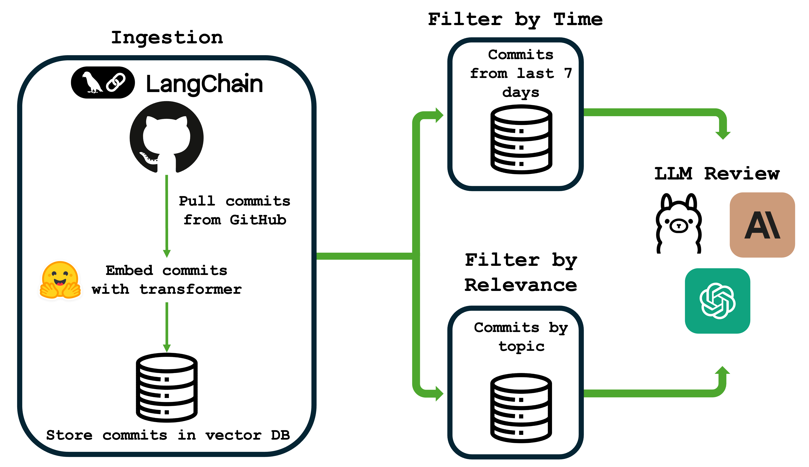

# Lab Ledger
Lab Ledger is a *micro* project meant to help you be a better computational biologist. Given a base directory, labLedger finds git repos and stores their commits for the past week. It then uses a summarization model to summarize your work.


# UPDATE
Lab Ledger, a project with no users other than its creator, is back to "pre-release" mode as I change this over to a RAG application, mostly for better understanding of what a RAG application is. Locally, you can use `ingest.py` on a repo of your choice to make a vector database of your commits. 

In a less stable state, `summarizer.py` currently can perform a "stand up audit" on your commits using the embeddings you created. 


## Motivation
Unlike wet-bench scientists, computationalists don't often have lab notebooks. Sometimes they have their own system, and this is mine.

> Commit early, commit often

This is an aphorism commonly used in software development, and I try and use it in my experimental work. To make better commits and to adequately log my progress, I try and write down my experiments and review them each week to tell if I understood what progress I made for the last week. This helps me better understand my code and better present my project.

## Installation

Install using pixi with `pixi install`. The only requirements are pytorch and the transformers library, but these are only necessary if you're looking for an automated summary.

## Usage

## Non-AI Usage
Mostly this is meant as a personal lab notebook, but I intend to make it more general over time. To use, run `reportCommits.sh` after configuring the file `labrat.conf`:

```
AUTHOR # Your email used for your git commits
BASE_DIR # Where to recursively search for git repos
OUTPUT # Where to store your output
SUMMARIZE # Boolean to run the summarization script
```

## RAG Usage


## Project Goals
While this project should not require much maintenance, there are several features I plan on implementing:

1. Commit flags. Commits could be prepended with tags such as RESULT: (commit message here) or FIGURE: (commit message here).

2. A TUI that allows you to "browse" your notebook. 

## Prior Work
While researching names for this project, I came across the project [gitSum](https://github.com/louis-hildebrand/gitsum). It is an incredible name but I think the outputs/scope of each project are sufficiently different. I also had a previous coworker who had a much more extreme computational setup which was the inspiration for this project. 
